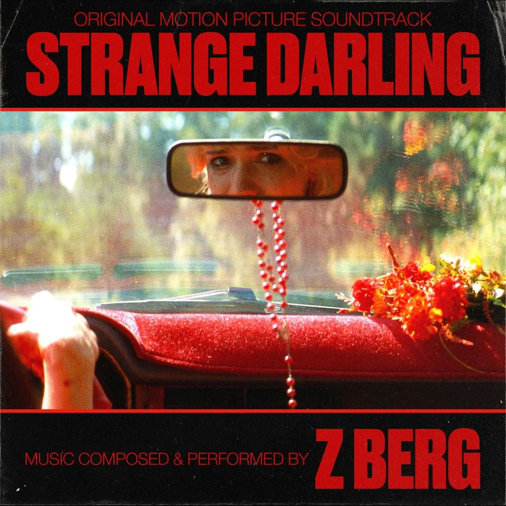
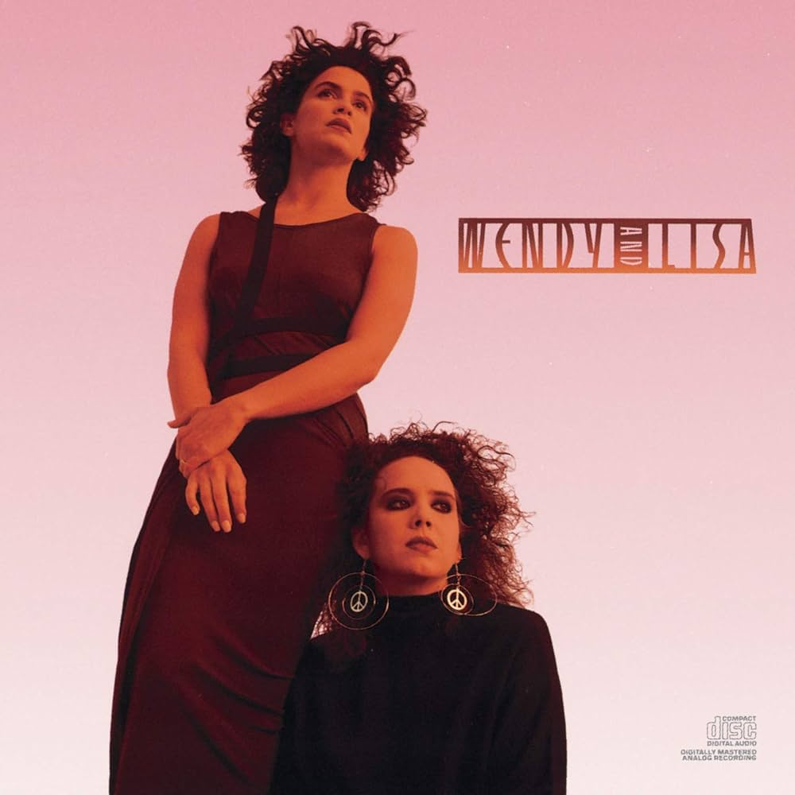
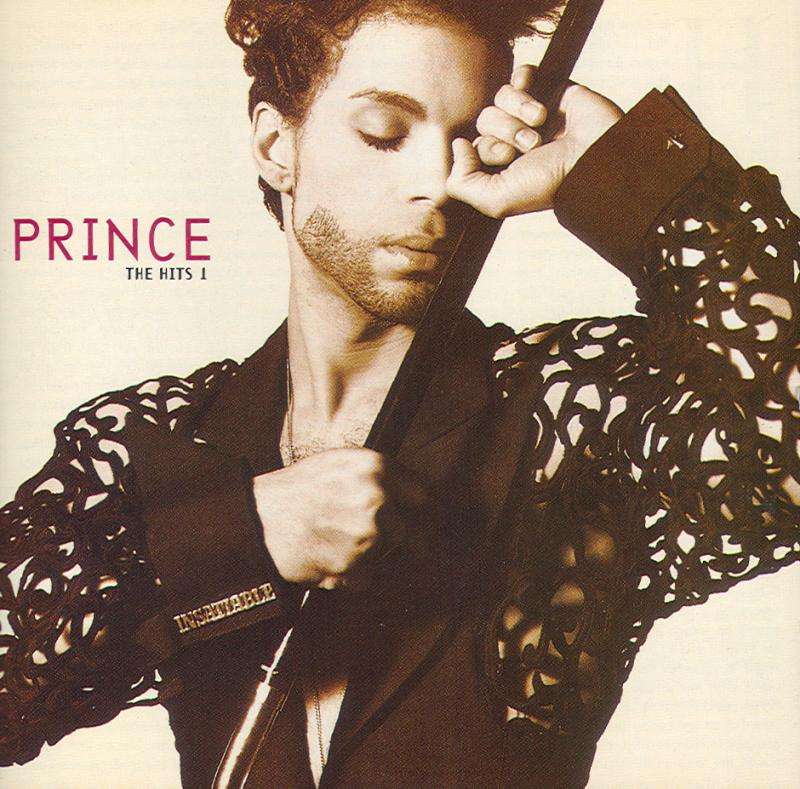
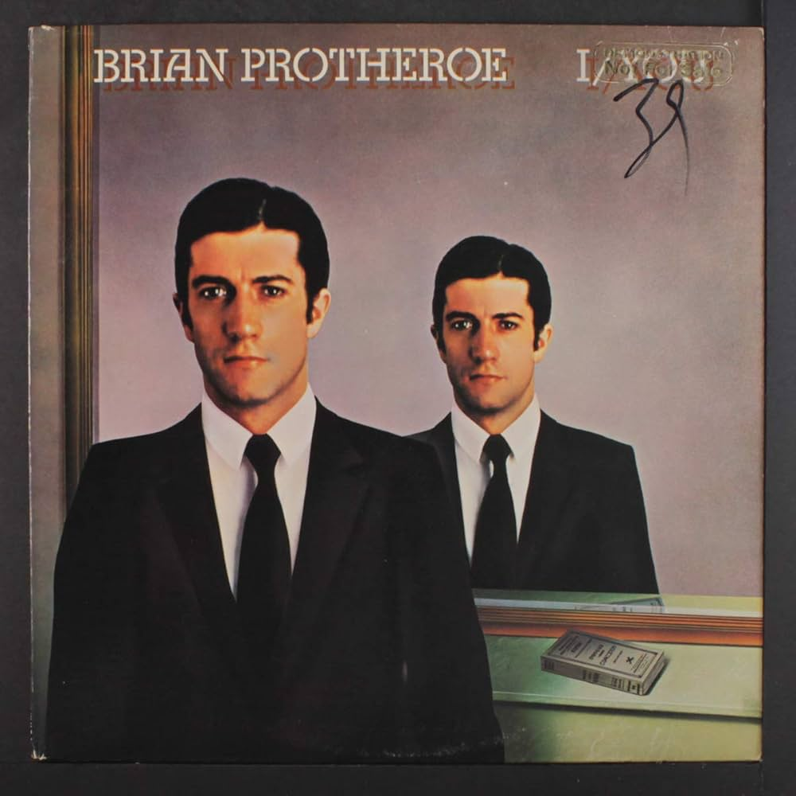
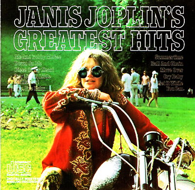

<!DOCTYPE html>
<html lang="en">
<head>
    <meta charset="UTF-8">
    <meta name="viewport" content="width=device-width, initial-scale=1.0">
    <title>MY WPUB RADIO SHOW PICS</title>
    
</head>
<body>

    <!-- Neon Flickering Title -->
    
MY WPUB RADIO SHOW PICS

    <!-- Conveyor Belt Left Side Images (Moving Up) -->
    

        <!-- Replace with your actual image paths -->
        
        
        
        
        
        <!-- Add more images as needed -->
    

    <!-- Conveyor Belt Right Side Images (Moving Down) -->
    

        <!-- Replace with your actual image paths -->
        
        
        
        
        <!-- Add more images as needed -->
    

    <!-- Show 5: On Stage -->
    
SHOW 5: On Stage

    

        
SUNDAY FINALE - STEPHEN SONDHEIM

        
MOVING TOO FAST - JASON ROBERT BROWN

        
THE BITCH OF LIVING - STEVEN SATER

    

    <!-- Show 4: My Top Pics -->
    
SHOW 4: My Top Pics

    

        
POP LIFE - PRINCE

        
FORGET HER - JEFF BUCKLEY

        
GET ON THE RIGHT THING - WINGS

        
PEANUT MAN - TIM BUCKLEY

    

    <!-- Show 3: Established/Underrated -->
    
SHOW 3: Established/Underrated

    

        
AND SHE WAS - TALKING HEADS

        
PINBALL - BRIAN PROTHEROE

        
LOVE HURTS - Z BERG

        
PARADISE - REX ORANGE COUNTY

    

    <!-- Show 2: The 27 Club -->
    
SHOW 2: The 27 Club

    

        
PEACE FROG - THE DOORS

        
BACK TO BLACK - AMY WINEHOUSE

        
WHO KNOWS - JIMI HENDRIX

        
MARIGOLD - NIRVANA

        
SYMPATHY FOR THE DEVIL - THE ROLLING STONES

        
AS GOOD AS YOU'VE BEEN TO THIS WORLD - JANIS JOPLIN

    

    <!-- Show 1: Gems -->
    
SHOW 1: Gems

    

        
POP MUZIC - M. ROBIN SCOTT

        
TOO SWEET - HOZIER

        
ZANZIBAR - BILLY JOEL

        
SILVERLINES - DAMIAN LABRINTH

        
WAH-WAH - GEORGE HARRISON

        
WHAT A GIRL WANTS - SABRINA CARPENTER

        
CHRISTINA AGUILERA

    

</body>
</html>

