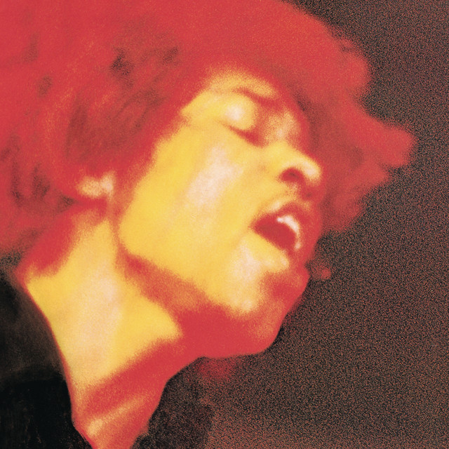

<!DOCTYPE html>
<html lang="en">
<head>
    <meta charset="UTF-8">
    <meta name="viewport" content="width=device-width, initial-scale=1.0">
    <title>MY WPUB RADIO SHOW PICS</title>
    
</head>
<body>

    <!-- Neon Flickering Title -->
    
MY WPUB RADIO SHOW PICS

    <!-- Conveyor Belt Left Side Images (Moving Up) -->
    

        
        
        
    

    <!-- Conveyor Belt Right Side Images (Moving Down) -->
    

        
        
        
    

    <!-- Subtitle and Song List -->
    
SHOW 5: On Stage

    

        
SUNDAY FINALE - STEPHEN SONDHEIM

        
MOVING TOO FAST - JASON ROBERT BROWN

    

</body>
</html>

